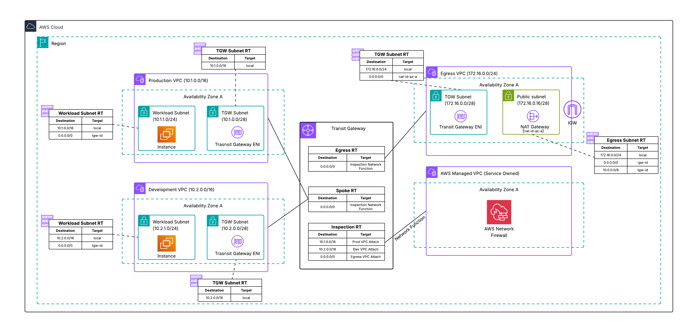

# AWS Network Security Workshop

This repository contains the CloudFormation template and firewall rules used in the AWS Workshop: [AWS Network Security Workshop](https://catalog.us-east-1.prod.workshops.aws/workshops/cbfa9f18-1175-4916-b7e7-e33dbbca9f9d).

## Workshop Link

For detailed instructions, please follow the workshop guide at:
[https://catalog.us-east-1.prod.workshops.aws/workshops/cbfa9f18-1175-4916-b7e7-e33dbbca9f9d](https://catalog.us-east-1.prod.workshops.aws/workshops/cbfa9f18-1175-4916-b7e7-e33dbbca9f9d)

## AWS Hosted Events

It's recommended to run through AWS workshops at AWS hosted events, like [Activation Days](https://aws-experience.com/amer/smb/events/series/activation-days), where AWS provides temporary accounts with workshop resources.

This workshop has been published open source mainly to allow the CloudFormation template and firewall rules to be referencable.

## Architecture

## Repository Contents

- **cfn-template/**: Contains the CloudFormation template (`template.yaml`) for deploying the workshop environment
- **firewall-rules/**: Contains AWS Network Firewall Suricata rules used in Labs 1 and 2 (see [firewall-rules/README.md](firewall-rules/README.md) for details)

## Deployment Instructions

The workshop environment can be deployed using the CloudFormation template provided in the `cfn-template` folder.

### Deployment Steps

1. Clone this repository
2. Navigate to the AWS CloudFormation console in **US East (N. Virginia) - us-east-1**
3. Choose "Create stack" > "With new resources (standard)"
4. Upload the `cfn-template/template.yaml` file
5. Follow the prompts to create the stack
6. Wait for the stack creation to complete (approximately 15-20 minutes)

## Cleanup

To delete all resources created by this workshop:
1. Navigate to the CloudFormation console in **US East (N. Virginia) - us-east-1**
2. Select the workshop stack
3. Choose "Delete"

## Security

See [CONTRIBUTING](CONTRIBUTING.md#security-issue-notifications) for more information.

## License

This library is licensed under the MIT-0 License. See the LICENSE file.

